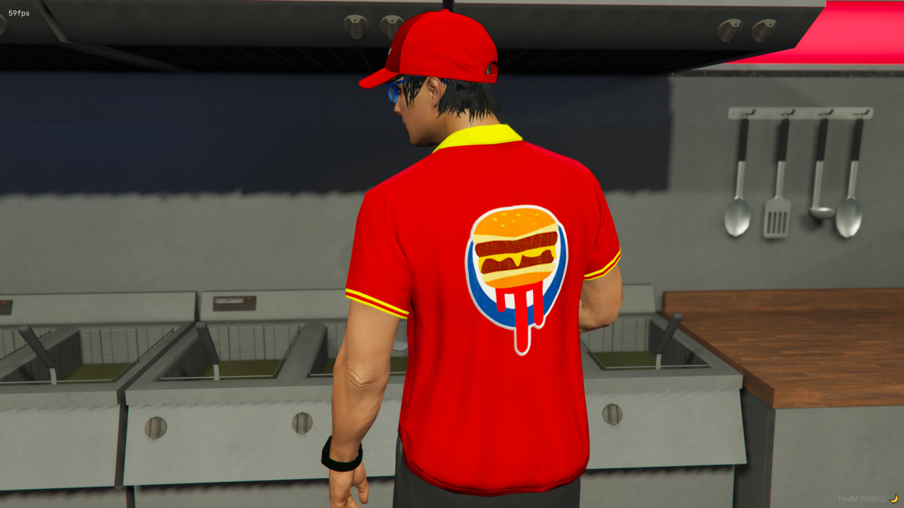

# BurgerShotClothPack 🍔👚🧢

Lore Friendly Burger Shot Clothing Pack For Alt V, FiveM &amp; Single Player by TayMcKenzieNZ **FREE OF CHARGE**

# Screenshots 📸

| | | |
|-|-|-|
|  |  |  |
|  |  |  |


==== Burger Shot Clothing by TayMcKenzieNZ ===


INSTALL INSTRUCTIONS
--------------------


Lore friendly add-on Burger Shot clothing for both Male and Female MP peds.

Content:

```
1x Male shirt, 2 textures - employee and manager
1x Male cap, 2 textures - employee and manager (front facing)
1x Male cap, 2 textures - employee and manager (backwards facing)

1x Female shirt, 2 textures - employee and manager 
1x Female cap, 2 textures - employee and manager (front facing)
1x Female cap, 2 textures - employee and manager (backwards facing)
```

--------------------------------------

## Single Player 

- Copy the taymckenzienzbs folder found within the FILES > SINGLE PLAYER folder  with the dlc.rpf file to this sub folder of your mods folder: mods/update/x64/dlcpacks (Create it if its not there)

- In order to make the game load this new dlc.rpf file, we need to modify the games dlclist.xml, this can be done by searching for dlclist.xml using OpenIV and copying it to your mods folder: mods/update/update.rpf/common/data (Create it if its not there)

- Open the dlclist.xml and add the following:

<Item>dlcpacks:/taymckenzienzbs/</Item>

To apply the new clothes you will need some mod menu, suggested ones are:
Menyoo: [https://github.com/MAFINS/MenyooSP/releases](https://gta5-mods.com/scripts/menyoo-pc-sp)

--------------------------------------

## ALTV

Open the FILES folder, go to ALTV and add taymckenzienzbs to your server.cfg as a separate line below resources and before the enclosing. Your server.cfg resources configuration could look similar to this:

```
resources: [
  altv-better-clothing,
  taymckenzienzbs
]
```

Start your server and connect to it

--------------------------------------

## FiveM

- Download vMenu and put it in your server/resources folder [vMenu](https://github.com/TomGrobbe/vMenu/releases)

- Open the FILES folder and drag the taymckenzienzbs inside the FIVEM folder, into your FiveM resources

- Add ensure taymckenzienzbs to your server.cfg

- Press M to open vMenu  and browse thru your new added clothes (They are always added to the end / last DLC clothes)

## IF THEY DO NOT APPEAR, YOU DO NOT HAVE THE REQUIRED PATREON SUBSCRIPTION TO STREAM CLOTHING.

# Regarding Crashes in FiveM:

Read [here](https://forum.cfx.re/t/tutorial-forcing-gamebuilds-on-fivem/4784977) regarding gamebuilds and clothing YMT limits
